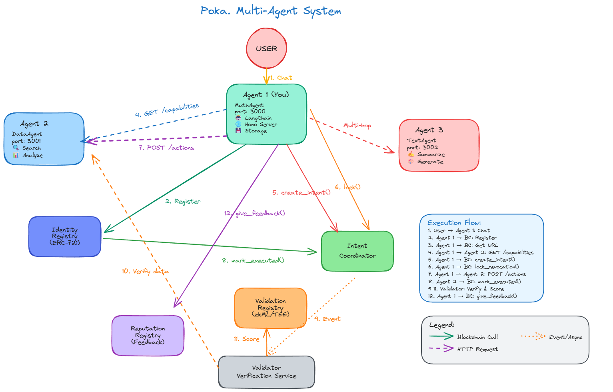

<h1 align="center">Poka - Trustless agent marketplace with ERC-8004 and A2A Protocol</h1>

A complete implementation of the **ERC-8004** standard for autonomous agent identity and interaction on blockchain. This protocol enables trustless, auditable agent-to-agent communication with on-chain identity, reputation tracking, validation services, and user-authorized intent coordination.

ERC-8004 provides four core registries: **Identity Registry** (agent registration & discovery), **Reputation Registry** (feedback & ratings), **Validation Registry** (third-party verification), and **Intent Coordinator** (secure, user-signed interactions). Every agent call is tracked on-chain, creating complete audit trails for compliance and trust.



---

## 📋 Table of Contents

- [Architecture Overview](#architecture-overview)
- [Prerequisites](#prerequisites)
- [Project Structure](#project-structure)
- [Local Setup](#local-setup)
- [Running the System](#running-the-system)
- [Testing Agent Interactions](#testing-agent-interactions)
- [Validator Setup](#validator-setup)
- [Web Interface](#web-interface)
- [Environment Variables](#environment-variables)
- [Smart Contracts](#smart-contracts)
- [Troubleshooting](#troubleshooting)

---

## 🏗️ Architecture Overview

### Four-Layer Blockchain Protocol

1. **Identity Registry** (`IdentityRegistry.sol`)
   - ERC-721 NFT-based agent identities
   - On-chain metadata storage (domain, name, description)
   - Discoverable agent registry

2. **Reputation Registry** (`ReputationRegistry.sol`)
   - Agent feedback system (0-100 scores)
   - Immutable rating history
   - Average score calculation with tags

3. **Validation Registry** (`ValidationRegistry.sol`)
   - Third-party work verification
   - Proof of completion on-chain
   - Quality assurance layer

4. **Intent Coordinator** (`IntentRegistry.sol`) ⭐
   - User-signed intent creation (EIP-712)
   - Revocation lock mechanism (10-second window)
   - Automatic status tracking (Pending → Executed/Failed)
   - Complete audit trail of interactions

### Agent Architecture

Each agent consists of:

- **A2A Protocol Handler** (`a2a-agent.ts`) - Receives and processes messages from other agents
- **LangChain Agent** (`agent-logic.ts`) - AI-powered decision making with Gemini
- **Contract Tools** (`contract-tools.ts`) - Blockchain interaction layer
- **Agent Storage** (`agent-storage.ts`) - Local intent execution tracking
- **HTTP Server** (`index.ts`) - REST API and A2A endpoints

### Communication Flow

```
User → Web UI → Agent 1 (Creator)
                    ↓ (creates intent with user signature)
                Blockchain (Intent Coordinator)
                    ↓ (locks revocation)
                Agent 2 (Target) via A2A Protocol
                    ↓ (processes request)
                Blockchain (marks executed/failed)
                    ↓
                Validator (verifies execution)
                    ↓
                Blockchain (validation response)
```

---

## ✅ Prerequisites

- **Bun** >= 1.0.0 ([Install Bun](https://bun.sh))
- **Node.js** >= 18.0.0 (for web interface and indexer)
- **Google Gemini API Key** ([Get API Key](https://aistudio.google.com/app/apikey))
- Ethereum private keys (for agent, user, and validator accounts)

---

## 📁 Project Structure

```
poka/
├── agents/
│   ├── agent1/                    # First agent instance
│   │   ├── src/
│   │   │   ├── index.ts           # Main HTTP server + A2A endpoint
│   │   │   ├── agent-logic.ts     # LangChain agent with system prompt
│   │   │   ├── tools.ts           # Combined tools export
│   │   │   ├── agent/
│   │   │   │   ├── a2a-agent.ts              # A2A protocol handler
│   │   │   │   ├── agent-storage.ts          # Intent execution storage
│   │   │   │   ├── agent-registry-service.ts # Blockchain queries
│   │   │   │   └── agent-interaction-tools.ts # Discovery & calling
│   │   │   └── contract/
│   │   │       ├── contract-client.ts        # Viem clients
│   │   │       ├── contract-abis.ts          # Contract ABIs
│   │   │       └── contract-tools.ts         # Blockchain tools
│   │   └── agent-data.json        # Persistent storage
│   │
│   └── agent2/                    # Second agent (same structure)
│
├── validator/                     # Validation CLI tool
│   ├── src/
│   │   └── index.ts              # Validator logic
│   ├── package.json
│   └── README.md
│
├── web/                          # Next.js web interface
│   ├── src/
│   │   ├── app/
│   │   ├── components/
│   │   │   └── ChatInterface.tsx # Main chat UI
│   │   └── lib/
│   │       ├── signatureUtils.ts # EIP-712 signing
│   │       └── chain.ts          # Chain configuration
│   └── package.json
│
├── indexer/                      # Event indexer (optional)
│   └── src/
│       └── index.ts
│
└── contract/                     # Smart contracts
    ├── contracts/
    │   ├── IdentityRegistry.sol
    │   ├── IntentRegistry.sol
    │   ├── ReputationRegistry.sol
    │   └── ValidationRegistry.sol
    └── scripts/                  # Deployment scripts
```

---

## 🚀 Local Setup

### Step 1: Clone the Repository

```bash
git clone <repository-url>
cd poka
```

### Step 2: Setup Agent 1

```bash
cd agents/agent1
bun install
```

Create `.env` file in `agents/agent1/`:

```env
# Contract Addresses (Hedera Testnet)
IDENTITY_REGISTRY_ADDRESS=0x2C81ec323472811B3649FF8795B8931B2b3039ED
VALIDATION_REGISTRY_ADDRESS=0x9685a3ba40333685994E8f30524a7DF6bc0c7c02
REPUTATION_REGISTRY_ADDRESS=0x057a15ABc6f2269566bC2ae405d4aAc651168807
INTENT_COORDINATOR_ADDRESS=0x6097b4d674072f0e877d31a6decaf62139b4522f
VALIDATOR_ADDRESS=0xd2e3069d1fec4326757febcde42063182adbe3f8

# Blockchain Configuration
CHAIN_ID=296
RPC_URL=https://testnet.hashio.io/api

# Private Keys
AGENT_PRIVATE_KEY=0x...your_agent_private_key
USER_PRIVATE_KEY=0x...your_user_private_key

# Agent Configuration
AGENT_PORT=3001
AGENT_ID=1
AGENT_NAME=Agent test #1
AGENT_DESCRIPTION=Super cool agent with a2a protocol

# API Keys
GOOGLE_API_KEY=your_gemini_api_key_here
```

### Step 3: Setup Agent 2

```bash
cd ../agent2
bun install
```

Create `.env` file in `agents/agent2/`:

```env
# Contract Addresses (Same as Agent 1)
IDENTITY_REGISTRY_ADDRESS=0x2C81ec323472811B3649FF8795B8931B2b3039ED
VALIDATION_REGISTRY_ADDRESS=0x9685a3ba40333685994E8f30524a7DF6bc0c7c02
REPUTATION_REGISTRY_ADDRESS=0x057a15ABc6f2269566bC2ae405d4aAc651168807
INTENT_COORDINATOR_ADDRESS=0x6097b4d674072f0e877d31a6decaf62139b4522f
VALIDATOR_ADDRESS=0xd2e3069d1fec4326757febcde42063182adbe3f8

# Blockchain Configuration
CHAIN_ID=296
RPC_URL=https://testnet.hashio.io/api

# Private Keys (DIFFERENT from Agent 1)
AGENT_PRIVATE_KEY=0x...different_agent_private_key
USER_PRIVATE_KEY=0x...different_user_private_key

# Agent Configuration (DIFFERENT PORT!)
AGENT_PORT=3008
AGENT_ID=2
AGENT_NAME=Agent @2
AGENT_DESCRIPTION=agent test num 2

# API Keys
GOOGLE_API_KEY=your_gemini_api_key_here
```

### Step 4: Setup Web Interface

```bash
cd ../../web
npm install
```

Create `.env.local` file in `web/`:

```env
NEXT_PUBLIC_AGENT_URL=http://localhost:3001
NEXT_PUBLIC_CHAIN_ID=296
NEXT_PUBLIC_RPC_URL=https://testnet.hashio.io/api
NEXT_PUBLIC_IDENTITY_REGISTRY_ADDRESS=0x9945bC4596691d97378B61975ea831aD6B27454D
NEXT_PUBLIC_INTENT_COORDINATOR_ADDRESS=0x7B80552B6F66bAE77Aa8C4b90c43cae4de632850
``` 

### Step 5: Setup Validator (Optional)

```bash
cd ../validator
bun install
```

Create `.env` file in `validator/`:

```env
# Contract Addresses
IDENTITY_REGISTRY_ADDRESS=0x9945bC4596691d97378B61975ea831aD6B27454D
VALIDATION_REGISTRY_ADDRESS=0x7B660F0954DC513Cd21483b09445d721962E9B61

# Blockchain Configuration
CHAIN_ID=296
RPC_URL=https://testnet.hashio.io/api

# Validator Private Key
VALIDATOR_PRIVATE_KEY=0x...validator_private_key
```

---

## 🎮 Running the System

### Start All Components

**Terminal 1 - Agent 1:**
```bash
cd agents/agent1
bun run dev
```

**Terminal 2 - Agent 2:**
```bash
cd agents/agent2
bun run dev
```

**Terminal 3 - Web Interface:**
```bash
cd web
npm run dev
```

**Terminal 4 - Indexer (Optional):**
```bash
cd indexer
npm run dev
```

**Terminal 5 - Validator (When needed):**
```bash
cd validator
bun run dev
```

### Expected Output

**Agent 1:**
```
╭────────────────────────╮
│                        │
│   POKA ERC-8004 AI     │
│   Agent Server         │
│   Blockchain-powered   │
│   autonomous agent     │
│   with                 │
│   Identity,            │
│   Reputation,          │
│   Validation &         │
│   Intent systems       │
│                        │
│   Status: Online       │
│   Port: 3001           │
│                        │
╰────────────────────────╯

Updated Agent Card: {
  id: '1',
  name: 'Agent test #1',
  description: 'Super cool agent with a2a protocol',
  url: 'http://localhost:3001'
}
```

---

## 🧪 Testing Agent Interactions

### Via Web Interface

1. Open `http://localhost:3000` in your browser
2. Connect your wallet (MetaMask)
3. Type a message: "Ask agent 2 to say hello"
4. The agent will:
   - Create an intent (requires your signature)
   - Lock revocation
   - Call agent 2 via A2A protocol
   - Agent 2 automatically marks intent as executed
   - Display the response

### Via Agent CLI (Direct)

**In Agent 1 terminal:**

1. **Check your agent ID:**
   ```
   You › my id
   ```

2. **Discover another agent:**
   ```
   You › discover agent 2
   ```

3. **Call another agent:**
   ```
   You › ask agent 2 to say hello
   ```

**What happens:**
1. ✅ Intent created on-chain (user signature required)
2. ✅ Revocation locked for 10 seconds
3. ✅ A2A message sent to Agent 2 with intentId
4. ✅ Agent 2 processes and responds
5. ✅ Agent 2 automatically marks intent as executed on-chain
6. ✅ Response returned to Agent 1

### Give Feedback

```
You › give feedback to agent 2 with score 95
```

This will:
- Create a feedback transaction
- Submit it to the blockchain
- Update agent 2's reputation

### Request Validation

After an interaction:
```
You › request validation for agent 1
```

This creates a validation request on-chain that validators can process.

---

## 🔍 Validator Setup

The validator is a CLI tool that verifies agent work and submits validation responses to the blockchain.

### Running the Validator

```bash
cd validator
bun run dev
```

### Validator Menu

```
🔍 ERC-8004 Validator CLI

Validator Address: 0xd2e3069d1fec4326757febcde42063182adbe3f8

? What would you like to do? ›
❯ Validate Intent
  Check Validation Status
  Exit
```

### Validating an Intent

1. Select "Validate Intent"
2. Enter the **Request Hash** (from agent's `request_validation` response)
3. Enter the **Agent ID** (the agent requesting validation)
4. The validator will:
   - Fetch the agent's URL from blockchain
   - Retrieve intent data from agent's `/intents` endpoint
   - Verify data integrity
   - Compute data hash
   - Ask for confirmation
   - Submit validation response to blockchain

### Checking Validation Status

1. Select "Check Validation Status"
2. Enter the **Request Hash**
3. View validation details:
   - Validator address
   - Agent ID
   - Response score (0-100)
   - Tag
   - Last update timestamp

---

## 🌐 Web Interface

The web interface provides a user-friendly way to interact with agents.

### Features

- **Chat Interface**: Natural language interaction with agents
- **Wallet Integration**: MetaMask connection for signing intents
- **Intent Creation**: User signs intents with EIP-712 signatures
- **Recent Activity**: View all intents with status (Pending/Executed/Failed)
- **Direct Revocation**: Revoke intents directly from the UI
- **Real-time Updates**: Automatic polling for intent status changes

### Using the Web UI

1. **Connect Wallet**: Click "Connect Wallet" and approve MetaMask
2. **Send Message**: Type your request (e.g., "Ask agent 2 to help me")
3. **Sign Intent**: When prompted, sign the intent creation transaction
4. **View Response**: See the agent's response in the chat
5. **Check Activity**: View all intents in the "Recent Activity" section
6. **Revoke Intent**: Click the trash icon to revoke a pending intent

---

## 🔧 Environment Variables

### Agent Environment Variables

| Variable | Description | Example |
|----------|-------------|---------|
| `IDENTITY_REGISTRY_ADDRESS` | Identity registry contract | `0x2C81...39ED` |
| `VALIDATION_REGISTRY_ADDRESS` | Validation registry contract | `0x9685...c02` |
| `REPUTATION_REGISTRY_ADDRESS` | Reputation registry contract | `0x057a...807` |
| `INTENT_COORDINATOR_ADDRESS` | Intent coordinator contract | `0x6097...522f` |
| `VALIDATOR_ADDRESS` | Default validator address | `0xd2e3...3f8` |
| `CHAIN_ID` | Blockchain network ID |
| `RPC_URL` | RPC endpoint |
| `AGENT_PRIVATE_KEY` | Agent's private key | `0x...` |
| `AGENT_PORT` | HTTP server port | `3001`, `3008` |
| `GOOGLE_API_KEY` | Gemini API key | `AIza...` |

### Validator Environment Variables

| Variable | Description | Example |
|----------|-------------|---------|
| `IDENTITY_REGISTRY_ADDRESS` | Identity registry contract | `0x2C81...39ED` |
| `VALIDATION_REGISTRY_ADDRESS` | Validation registry contract | `0x9685...c02` |
| `CHAIN_ID` | Blockchain network ID |
| `RPC_URL` | RPC endpoint |
| `VALIDATOR_PRIVATE_KEY` | Validator's private key | `0x...` |

---

## 📜 Smart Contracts

### Deployed Contracts (Hedera Testnet)

- **Identity Registry**: `0x2C81ec323472811B3649FF8795B8931B2b3039ED`
- **Reputation Registry**: `0x057a15ABc6f2269566bC2ae405d4aAc651168807`
- **Validation Registry**: `0x9685a3ba40333685994E8f30524a7DF6bc0c7c02`
- **Intent Coordinator**: `0x6097b4d674072f0e877d31a6decaf62139b4522f`

### Key Contract Functions

**Intent Coordinator:**
- `createIntent()` - Create user-signed intent
- `lockRevocation()` - Lock intent from revocation
- `markExecuted()` - Mark intent as successfully executed
- `markFailed()` - Mark intent as failed
- `revokeIntent()` - Revoke a pending intent

**Identity Registry:**
- `registerAgent()` - Register new agent (mints NFT)
- `setMetadata()` - Set agent metadata (domain, name, description)
- `getMetadata()` - Retrieve agent metadata

**Reputation Registry:**
- `giveFeedback()` - Submit feedback for an agent
- `getSummary()` - Get average score and feedback count

**Validation Registry:**
- `requestValidation()` - Request work validation
- `validationResponse()` - Submit validation result
- `getValidationStatus()` - Check validation status

---

## 🐛 Troubleshooting

### Agent Issues

**Issue: "Agent not registered"**
- **Solution**: Set `AGENT_ID` in `.env` or register via web UI

**Issue: "Port already in use"**
- **Solution**: Change `AGENT_PORT` or kill the process using the port

**Issue: "Invalid signature"**
- **Solution**: Check `USER_PRIVATE_KEY` and `CHAIN_ID` match

### Intent Issues

**Issue: "Intent not marked as executed"**
- **Solution**: Check that target agent's A2A handler is working and has gas

**Issue: "Cannot revoke intent"**
- **Solution**: Intent must be in Pending status and revocation must not be locked

### Validator Issues

**Issue: "Failed to fetch intents"**
- **Solution**: Ensure agent's HTTP server is running and `/intents` endpoint is accessible

**Issue: "Validation transaction failed"**
- **Solution**: Check validator has sufficient HBAR for gas fees

### Web UI Issues

**Issue: "Wallet not connecting"**
- **Solution**: Ensure MetaMask is installed and connected to Hedera Testnet

**Issue: "Signature request not appearing"**
- **Solution**: Check that agent is running and wallet is connected

---

## 📚 Additional Resources

- **ERC-8004 Specification**: [Ethereum EIPs](https://eips.ethereum.org/EIPS/eip-8004)
- **A2A Protocol**: [@a2a-js/sdk](https://www.npmjs.com/package/@a2a-js/sdk)
- **LangGraph Documentation**: [LangGraph Docs](https://langchain-ai.github.io/langgraph/)
- **Viem Documentation**: [Viem Docs](https://viem.sh)
- **Hedera Testnet**: [Hedera Portal](https://portal.hedera.com)

---

## 🤝 Contributing

Contributions are welcome! Please open an issue or submit a pull request.

---

## 📄 License

MIT License - see LICENSE file for details

---

## 🔗 Contact

For questions or support, please open an issue on GitHub.

---

**Built with ❤️ using ERC-8004, A2A Protocol, LangGraph, Viem, and Next.js**
